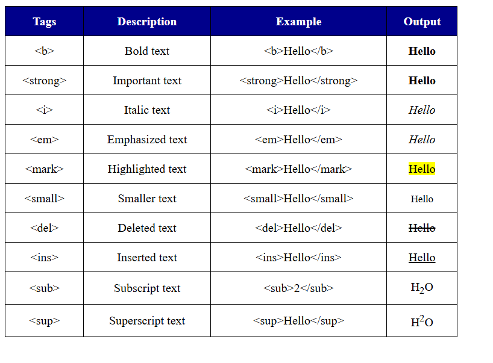

# Assignment 1: HTML Text Formatting Tags

## Problem Statement
Create a static web page which defines all text formatting tags of HTML in tabular format.

## Objective
To understand and implement HTML formatting tags.

## Explanation
This assignment demonstrates various HTML formatting tags like bold, italic, underline, etc. using a table.

## Output
