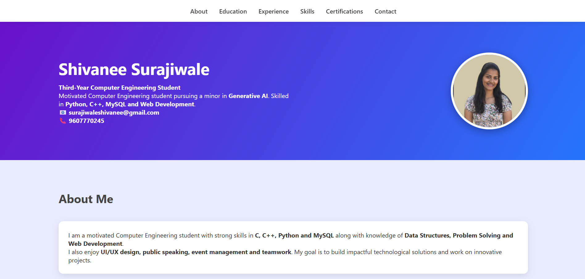
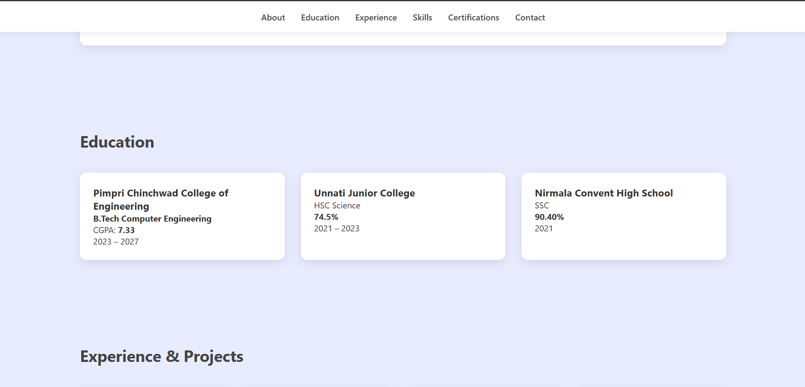
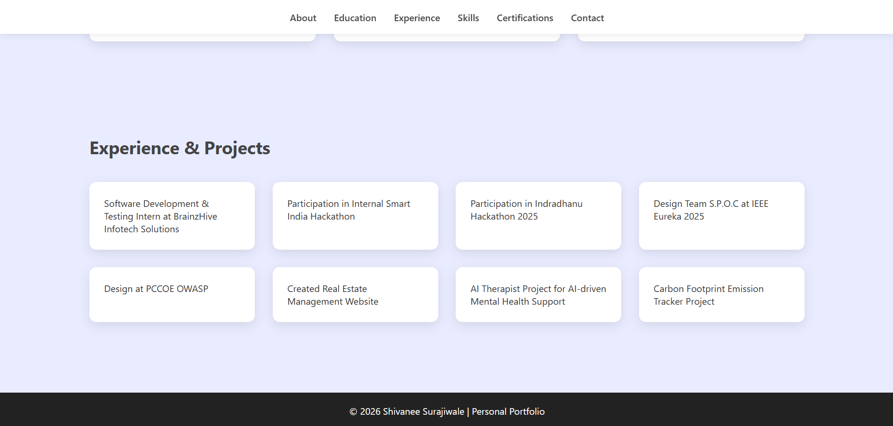

# Assignment 2: Personal Portfolio Website

## Problem Statement

Design a Personal Portfolio Page using HTML and CSS. Use Bootstrap CDN if required.

## Objective

The objective of this assignment is to create a personal portfolio webpage to showcase skills, projects, and personal information using HTML and CSS.

## Explanation

In this assignment, a personal portfolio website is developed using HTML and CSS. The webpage includes sections such as introduction, skills, projects, and contact information.

The layout is designed to be clean and user-friendly. Styling is applied using CSS (and Bootstrap if used) to enhance the visual appearance of the webpage.

## Technologies Used

* HTML
* CSS

## Output

## Conclusion

This assignment helped in understanding how to design and structure a personal portfolio website using HTML and CSS, which is essential for showcasing projects and skills.
